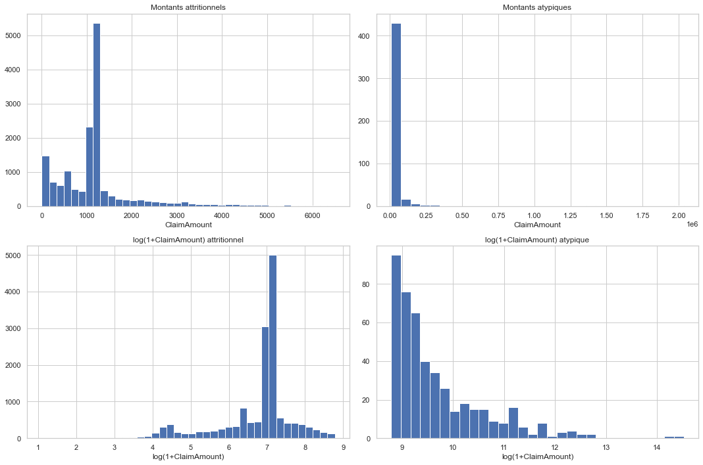
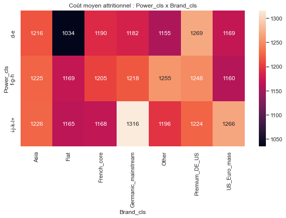
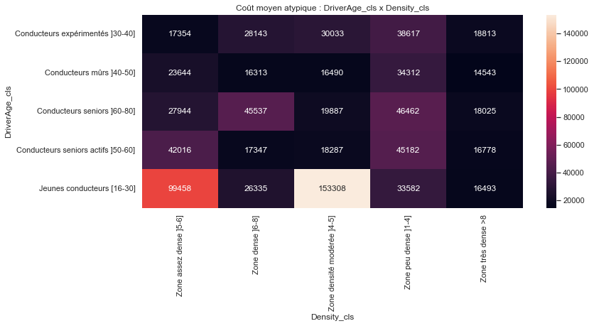
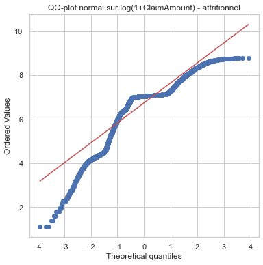
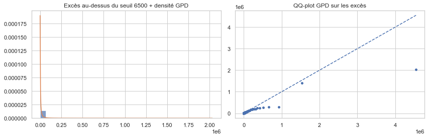
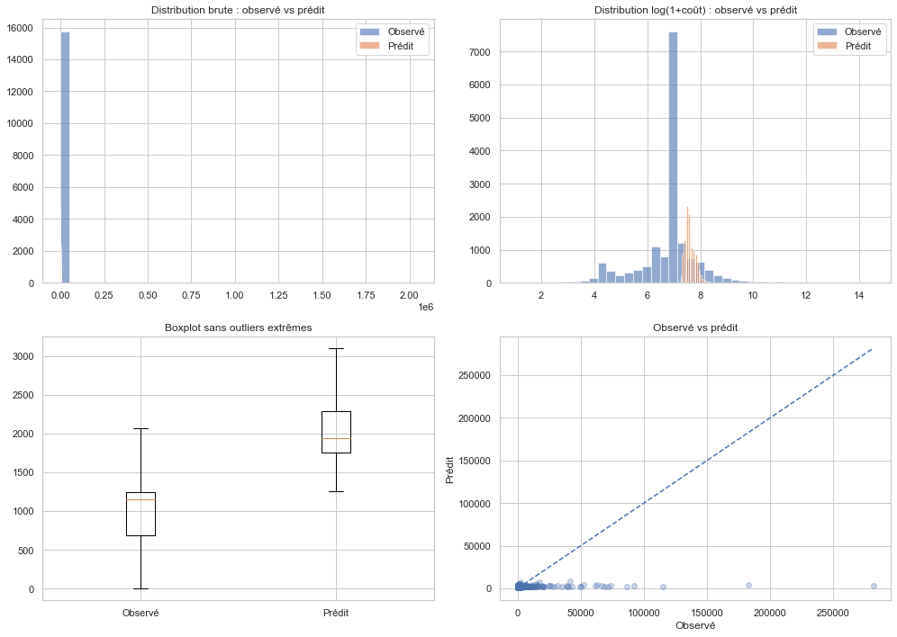
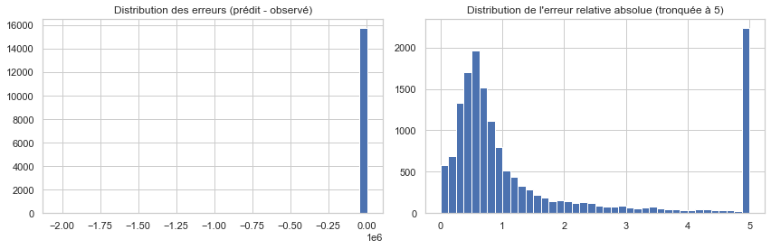

# Motor Insurance Pricing — GLM versus Machine Learning with EVT

End-to-end pricing pipeline for a French motor third-party liability portfolio, comparing a classical GLM approach against a machine-learning approach with extreme-value theory (EVT) for large claims. Frequency-severity decomposition on both sides, hybrid attritional / atypical treatment on the ML side, and reference-policyholder benchmark for direct comparison.

Academic project (M2 Actuariat, ISFA — Advanced Pricing / *Projet d'Assurance Tarification et Provisionnement*), Co-authored with S. Diouf, C. A. D. Kouamé and S. Ouattara.

## Data

Public academic dataset from the R package **CASdatasets**:

- `freMTPLfreq` — 413,169 French motor policies with frequency features (Exposure, Power, CarAge, DriverAge, Brand, Gas, Region, Density) and claim counts
- `freMTPLsev` — 16,181 individual claim amounts linked by `PolicyID`

Loaded with:

```r
library(CASdatasets)
data(freMTPLfreq)
data(freMTPLsev)
```

## Content

Two independent implementations working on the same cleaned data:

| File | Language | Purpose |
|---|---|---|
| `src/tp_final.Rmd` | R Markdown | Full GLM pipeline (frequency + severity) |
| `src/notebook_modele_couts_ML_EVT.ipynb` | Python | ML pipeline for claim cost (attritional + atypical, EVT-GPD) |
| `PATP.pdf` | — | Full project report |

## R Markdown — GLM approach (`tp_final.Rmd`)

10 numbered sections walking through the full actuarial pricing workflow:

1. **Data loading and initial exploration** — merging `freMTPLfreq` and `freMTPLsev`
2. **Base construction** — aggregation of total claim cost per policy
3. **Cleaning** — Exposure > 1 filtering, CarAge > 20 filtering, coherence checks
4. **CAT / atypical claims treatment** — threshold selection, dedicated CAT surcharge
5. **Univariate exploratory analysis** — DriverAge, CarAge, Power, Density recoding by severity
6. **Variable recoding** — modality regrouping based on severity, not frequency (e.g. Power groups `n-o | d-e-f-g-k | h-i-j | l-m`)
7. **Train / test split** — reproducible partition with stratification
8. **Frequency modelling**:
   - Null Poisson (`pois0`) → annualised frequency 0.0698 claim/year
   - Full Poisson (`pois1`)
   - Backward stepwise AIC selection on design matrix → `pois5`
   - Negative Binomial (`nbinom1`) — overdispersion test
   - Zero-Inflated Poisson / Negative Binomial (ZIP, ZINB), Hurdle
   - Head-to-head comparison table (AIC, out-of-sample MAE)
9. **Severity modelling**:
   - Gamma with variable selection (`gamma4`)
   - Log-normal (`gauss2`)
   - Inverse Gaussian (`igauss4`)
   - Comparison and final choice
10. **Reference pure premium** — combined frequency × severity, per reference policyholder profile

Run the whole pipeline with:

```r
rmarkdown::render("src/tp_final.Rmd")
```

## Python notebook — ML / EVT approach

Complements the GLM pipeline with a modern data-science treatment of the cost component:

1. **Structural audit** and column selection
2. **Descriptive analysis** of claim amounts, log-transformed and split attritional vs atypical:



3. **Distribution fitting** on attritional claims (log-normal, gamma, Weibull with QQ-plot diagnostics):





4. **Extreme Value Theory** — Generalized Pareto Distribution fit on excesses above threshold, with QQ-plot for tail validation:



5. **Attritional cost modelling** — ML regressors benchmarked against the GLM baseline
6. **Atypical cost modelling** — GPD + ML classifier for the "attritional vs atypical" probability
7. **Recombined per-claim premium** — weighted combination of both regimes:




## Why this project matters

Beyond the technical benchmark, the project reflects the real trade-off insurers face today: GLMs are interpretable and regulatorily accepted; ML plus EVT delivers better tail accuracy but harder to defend to a supervisor. The synthesis in the report discusses when each wins in practice.

## Requirements

**R side:**
```r
install.packages(c("CASdatasets", "MASS", "pscl", "boot",
                   "caret", "ggplot2", "dplyr"))
```

**Python side** — see `requirements.txt`:
```
numpy
pandas
matplotlib
seaborn
scipy
scikit-learn
statsmodels
```

## Report

See `PATP.pdf` for the full methodology, plots, model diagnostics and quantitative comparisons.
